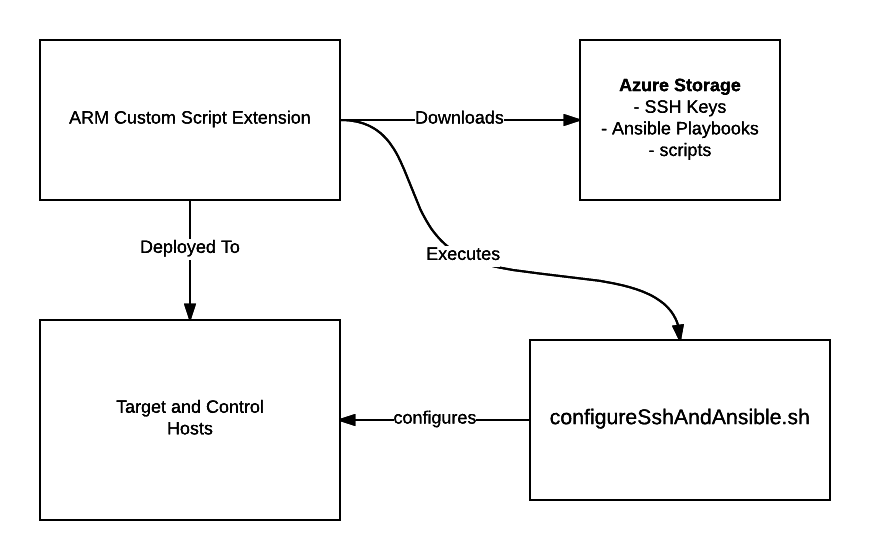

# Using Azure Linux Custom Script Extensions to install Ansible #

This example builds on the [Azure Linux IaaS](https://github.com/jungho/azure-linux-iaas-example) example.  See the deployment diagram in that repository to understand the hosts we will be interacting with.  

We will use [linux custom script extensions](https://docs.microsoft.com/en-ca/azure/virtual-machines/virtual-machines-linux-extensions-features?toc=%2fazure%2fvirtual-machines%2flinux%2ftoc.json) to do the following:

1. set up the ssh authentication across all hosts
2. install Ansible on the control and target hosts
3. Download the playbooks.tar.gz file onto the control vm.

Once deployed, we will log onto the control machine (which will be the jumpbox), create the inventory file and verify ansible is installed on all hosts.

Here is the logical flow and dependencies.



## Assumptions

This example assumes a debian based Linux distribution. If you take a look at [azureDeploy.json](./arm/azureDeploy.json) you will see that
I use Ubuntu.  This is important as I use the native package manager in the shell scripts.

## Pre-requisites

1. In order to execute these templates, you need to have a pre-existing storage account, it must be a 'General Purpose' account. Provide the name of the storage account in the [parameters template](./arm/azureDeploy.parameters.json). 
2. You will need three blob containers in your storage account for keys, vhds, and scripts. Either use the default names I have defined in the parameters template or choose your own.
3. Create a ssh key pair (with no pass phrase) and upload them the keys container.  These keys will be accessed by the scripts executed by the custom script extension to enable ssh authentication on all the required hosts.  See the man pages for 'ssh-keygen' to generate RSA key pairs.
4. Upload the [configSsh.sh](./scripts/configSsh.sh) script to the scripts container.  
5. Create a gzipped archive of the playbooks directory and upload it to the scripts container.  Make sure the name of the file is specified in the [parameters template](./arm/azureDeploy.parameters.json).
6. You also need to have a pre-existing Azure Key Vault resource with a secret named 'adminPassword' that stores the admin user password. Go [here](https://docs.microsoft.com/en-us/azure/azure-resource-manager/resource-manager-keyvault-parameter) for instructions. 
7. Add the storage account access key as a secret in Key Vault.  Name it 'storageAccessKey'.  This is necessary to access the storage account when the custom script extension executes.  Another strategy is to leverage [shared access signature](https://docs.microsoft.com/en-us/azure/storage/storage-dotnet-shared-access-signature-part-1) to use temporary keys.  However, in our case the access key is only accessed by authenticated users so this is not necessary.
8. Install Azure CLI.  The instructions for your OS is [here](https://docs.microsoft.com/en-us/azure/xplat-cli-install). 

*IMPORTANT: make sure the access policy for the storage is private!*

You can change the name of the files to retrieve from the storage account by overriding the following parameters in [azureDeploy.parameters.json](./arm/azureDeploy.parameters.json).

* sshPrivateKey
* sshPublicKey
* configureSshAndAnsibleScriptName
* ansiblePlaybooks

Also update the keyvault ID for the adminPassword and storageAccessKey parameters.  You can get this information from your instance of the key value.  Note:  My ids currently in the parameters have been disabled!!

## Deployment

To deploy the template using Azure CLI execute the following commands.  Note, I assume the storage account resource group has already been created.  

```
#login to azure and follow the instructions
azure login

#Create a resource group for your deployment, location would be "Canada East"
azure group create -n <resource-group-name> -l <location>

#Always validate the template prior to trying to deploy it to catch any errors that may exist. The '-vv' switch means 'verbose'
azure group template validate -f azureDeploy.json -e azureDeploy.parameters.json -g <resource-group-name> -vv

#if the template is valid...
azure group deployment create -f azureDeploy.json -e azureDeploy.parameters.json -g <resource-group-name> -n <deployment-name>

#to check the status of the deployed extension
azure vm extension get <resource-group-name> <vmName>

#after successful deployment, execute the following command to retrieve the hostnames of the vms that were created.
#you will need this to create the ansible inventory file.
azure vm list -g <resource-group-name>

```

Note, you can all use [deployTemplate.sh](./arm/deployTemplate.sh) that wraps the azure cli commands.  

```
#to validate and deploy
./deployTemplate.sh -g <resource-group-name> -n <deployment-name>

#to validate ONLY
./deployTemplate.sh -g <resource-group-name> -n <deployment-name> -v

```

## Troubleshooting the Custom Script Extension Deployment

The custom script extension will download the scripts to a directory in /var/lib/waagent/custom-script/download.  Depending on how many
extensions you install, there will be a directory 0, 1, 2 etc...

The scripts will execute from this directory and it will not be on the path so you MUST prefix you command with 'bash '.  Search for the 'commandBase' variable in [azureDeploy.json](./arm/azureDeploy.json).

See [Troubleshooting](https://docs.microsoft.com/en-us/azure/virtual-machines/virtual-machines-linux-extensions-customscript#troubleshooting) to understand where you have to go to see the error messages to help trouble shoot.  Note, you need to 'sudo su' prior to trying to access the error logs. 

## References

1. [Azure Linux Custom Script Extensions](https://docs.microsoft.com/en-ca/azure/virtual-machines/virtual-machines-linux-extensions-features?toc=%2fazure%2fvirtual-machines%2flinux%2ftoc.json)
2. [Linux VM extension configuration samples](https://acom-feature-videos-twitter-card.azurewebsites.net/en-us/documentation/articles/virtual-machines-linux-extensions-configuration-samples/)
3. [Ansible docs](http://docs.ansible.com/ansible/index.html)
